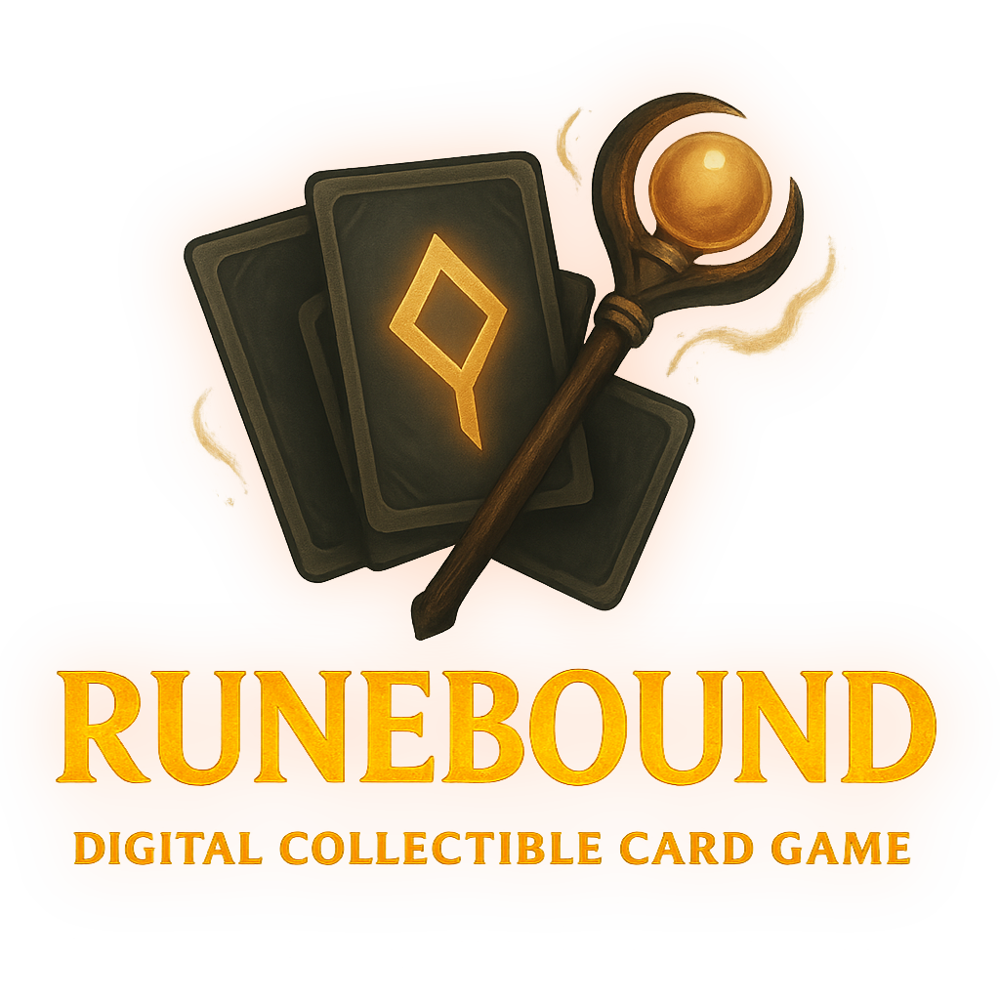
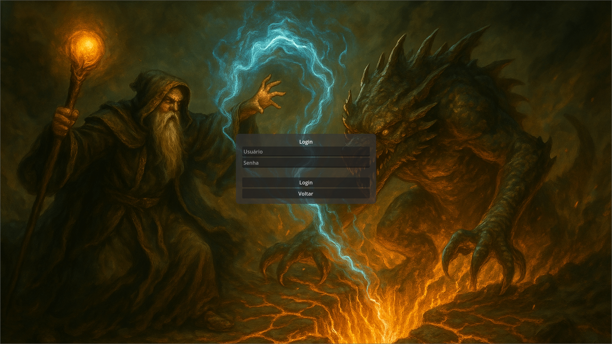
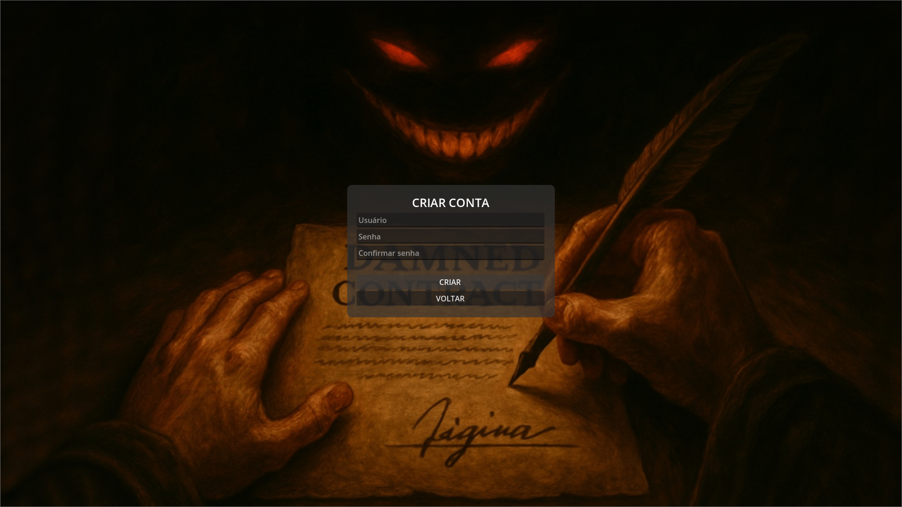

##Runebound - Digital Collectible Card Game

## Sumário

* [Visão Geral](#visão-geral)
* [Funcionalidades](#funcionalidades)
* [Capturas de Tela](#capturas-de-tela)
* [Tecnologias](#tecnologias)
* [Instalação](#instalação)
* [Uso](#uso)
* [Estado do Desenvolvimento](#estado-do-desenvolvimento)
* [Planos Futuros](#planos-futuros)
* [Contribuição](#contribuição)
* [Licença](#licença)

---

## Visão Geral



**Runebound - Digital Collectible Card Game** é um protótipo de *Collectible Card Game* (CCG) 1 × 1 construído no **Godot 4.4**. Todos os menus, telas e lógica de jogo são implementados como cenas (`*.tscn`) e scripts em **GDScript 2.0**, seguindo a hierarquia de nós do engine ([Godot Engine][1], [YouTube][2]).

Características centrais de gameplay:

* **Tipos de Carta**

  * **Creatures** – unidades com Ataque / Resistência.
  * **Runebindings** – efeitos contínuos ou temporários.
  * **Instants** – feitiços de impacto imediato.
* **Sistema de Mana** – inicia em 0; o jogador deve *descartar* uma carta na Fase de Mana para aumentar o máximo de mana (limite 10).
* **Construção de Deck** – 30 – 40 cartas por deck.
* **Fases do Turno** – Mana → Draw → Main → Attack → End.
* **Objetivo** – reduzir os 20 pontos de vida do oponente a 0.

---

## Funcionalidades

### Estrutura de Projeto Godot

| Módulo                  | Descrição                                                                                                                                  |
| ----------------------- | ------------------------------------------------------------------------------------------------------------------------------------------ |
| **Autoload Singletons** | `AccountManager`, `GameState`, `ScreenManager` para estado global ([Godot Engine documentation][3])                                        |
| **Scenes**              | *Splash*, *Title* (efeito Ken Burns), *Login*, *CreateAccount*, *Profile*, *DeckBuilder*, *Battle*, *Options*                              |
| **Recursos**            | Cartas salvas como `Card.tres`; banco de dados indexado em `CardDatabase.gd` usando `DirAccess` + `ResourceLoader`.                        |
| **Persistência**        | Dados de conta/deck gravados em `user://accounts.json` com `FileAccess` ([Godot Engine documentation][4], [Godot Engine documentation][5]) |
| **UI**                  | Construída com nós **Control** (VBoxContainer, TextureRect, Button etc.) ([Godot Engine documentation][6])                                 |
| **Animações**           | `AnimationPlayer` para Ken Burns + Cross-Fade; `Timer` controla intervalo ([Reddit][7], [Godot Engine documentation][8])                   |

### Jogabilidade (protótipo)

* **Gerenciamento de Conta:** criar / login / logout; dados persistem em arquivo local; senhas ainda em texto puro (apenas para testes).
* **Deck Builder:** drag-and-drop interno do Godot; validação automática.
* **Tela de Batalha:** fluxo de fases, consumo de mana, log de ações.
* **Opções:** volume global, idioma (placeholder), contraste.
* **Exportação:** projeto configurado para desktop; *export templates* de Android prontos para build ([Godot Engine documentation][9]).

---

## Capturas de Tela

<!-- Substitua pelos seus PNGs/JPGs exportados do Godot -->




---

## Tecnologias

| Camada    | Ferramenta                                                                                   |
| --------- | -------------------------------------------------------------------------------------------- |
| Motor     | **Godot Engine 4.4.1** (licença MIT) ([Godot Engine][10])                                    |
| Linguagem | **GDScript 2.0** – tipagem estática, corrotinas via `await` ([YouTube][2], [Reddit][11])     |
| Add-ons   | Nenhum obrigatório; opcionalmente **GodotSteam** para futuro *online* / *Steam API*.         |
| Constrói  | Exportação automática para Windows, Linux, macOS e Android ([Godot Engine documentation][9]) |

---

## Instalação

```bash
# 1. Clone o repositório
git clone https://github.com/SEU_USUARIO/runebound-godot.git
cd runebound-godot

# 2. Abra no Godot 4.4+
godot4 .
```

> **Primeira execução** cria `user://accounts.json` dentro da pasta de dados do Godot.

Para exportar:

```bash
# Instale os export templates oficiais
godot4 --headless --install-export-templates

# Exporte para Windows (exemplo)
godot4 --headless --export-release "Windows Desktop" build/Runebound.exe
```

---

## Uso

1. **Splash → TitleScreen** com Animação Ken Burns automática.
2. Clique **Criar Conta** ou **Login**.
3. No **Profile**, edite avatar, abra **Deck Builder**, exporte deck.
4. **Connect** inicia partida local (IA em desenvolvimento).

---

## Estado do Desenvolvimento

| Componente                      | Status             |
| ------------------------------- | ------------------ |
| Básico de contas / deck / telas | **✔ Completo**     |
| Motor de efeitos de carta       | 🟡 Em andamento    |
| Combate e cálculo de dano       | 🟡 Em andamento    |
| Redes (multiplayer)             | 🔴 Planejado       |
| Export Android / Steam          | 🟡 Pré-configurado |

---

## Planos Futuros

* Implementar **lógica completa de efeitos** e alvo.
* **Netcode** P2P com WebRTC ou ENet.
* Animações de combate com `Tween` / `AnimationPlayer`.
* Integração com **Steam Workshop** para compartilhamento de decks.
* Mais conjuntos de cartas e eventos de torneio no jogo.

---

## Contribuição

Sinta-se livre para *forkar*, explorar e abrir *issues* para bugs ou ideias. Pull Requests são bem-vindos; descreva claramente a alteração e siga as *Godot GDScript style guidelines*.

---

## Licença

Projeto ainda **não licenciado**. Entre em contato para permissões.

Contato: [fredericomonteiromendesmaia@gmail.com](mailto:fredericomonteiromendesmaia@gmail.com)

---

### Fontes consultadas

1. Notas de versão Godot 4.4 ([Godot Engine][1])
2. Novidades do GDScript 2.0 ([YouTube][2])
3. Autoload (Singleton) ([Godot Engine documentation][3])
4. Paths `res://` e `user://` ([Godot Engine documentation][4])
5. UI com Control Nodes ([Godot Engine documentation][6])
6. Exemplo de fade entre cenas ([Reddit][7])
7. Documentação do Timer ([Godot Engine documentation][8])
8. ResourceSaver para salvar `.tres` ([Godot Engine documentation][12])
9. Exportação Android ([Godot Engine documentation][9])
10. Ferramentas de debug ([Godot Engine documentation][13])

[1]: https://godotengine.org/releases/4.4/?utm_source=chatgpt.com "Godot 4.4, a unified experience"
[2]: https://www.youtube.com/watch?v=urIwgvBec_o&utm_source=chatgpt.com "GDScript 2.0 in Godot 4 -- What's New? - YouTube"
[3]: https://docs.godotengine.org/en/latest/tutorials/scripting/singletons_autoload.html?utm_source=chatgpt.com "Singletons (Autoload) - Godot Docs"
[4]: https://docs.godotengine.org/en/latest/tutorials/io/data_paths.html?utm_source=chatgpt.com "File paths in Godot projects - Godot Docs"
[5]: https://docs.godotengine.org/en/stable/tutorials/scripting/filesystem.html?utm_source=chatgpt.com "File system — Godot Engine (stable) documentation in English"
[6]: https://docs.godotengine.org/en/3.1/getting_started/step_by_step/ui_introduction_to_the_ui_system.html?utm_source=chatgpt.com "Design interfaces with the Control nodes - Godot Docs"
[7]: https://www.reddit.com/r/godot/comments/n17ct2/tutorial_on_how_to_create_a_simple_fade/?utm_source=chatgpt.com "Tutorial on how to create a simple fade transition animation between ..."
[8]: https://docs.godotengine.org/en/stable/classes/class_timer.html?utm_source=chatgpt.com "Timer — Godot Engine (stable) documentation in English"
[9]: https://docs.godotengine.org/en/stable/tutorials/export/exporting_for_android.html?utm_source=chatgpt.com "Exporting for Android - Godot Docs"
[10]: https://godotengine.org/article/maintenance-release-godot-4-4-1/?utm_source=chatgpt.com "Maintenance release: Godot 4.4.1"
[11]: https://www.reddit.com/r/godot/comments/15qxlqy/gdscript_20_vs_gdscript_40/?utm_source=chatgpt.com "Gdscript 2.0 vs Gdscript 4.0 : r/godot - Reddit"
[12]: https://docs.godotengine.org/en/stable/classes/class_resourcesaver.html?utm_source=chatgpt.com "ResourceSaver — Godot Engine (stable) documentation in English"
[13]: https://docs.godotengine.org/en/stable/tutorials/scripting/debug/overview_of_debugging_tools.html?utm_source=chatgpt.com "Overview of debugging tools - Godot Docs"
